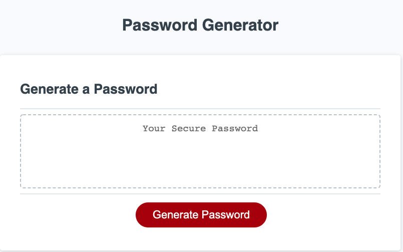
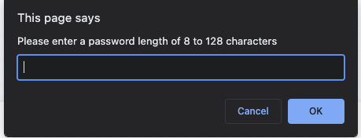
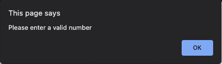
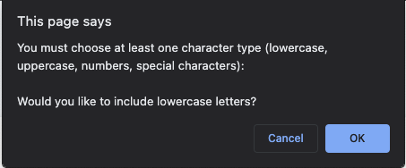
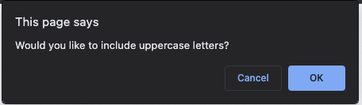
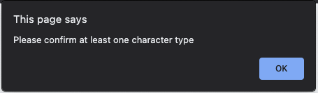
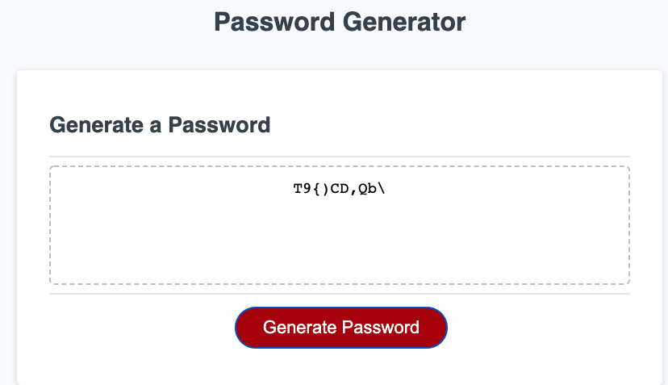

# PASSWORD GENERATOR

## An in-browser password generator that creates a password for the user based on answers to prompts() and confirms()

 

[CHECK IT OUT HERE!](https://tbro4.github.io/password-generator/)

 

 

## When the Generate Password button is clicked, the user is asked to input a length of 8 to 128

 

## Invalid options tell the user to enter a valid option and restarts the process

 

## The user is then asked to confirm at least one variable type (via 4 seperate confirms()) (lowercase, uppercase, numbers, and/or special characters)

 

 

 

 

 

## If they hit no (Cancel) on all four prompts they are asked to confirm at least one type

 

 

## A password is displayed on the page that fits the chosen criteria

 

